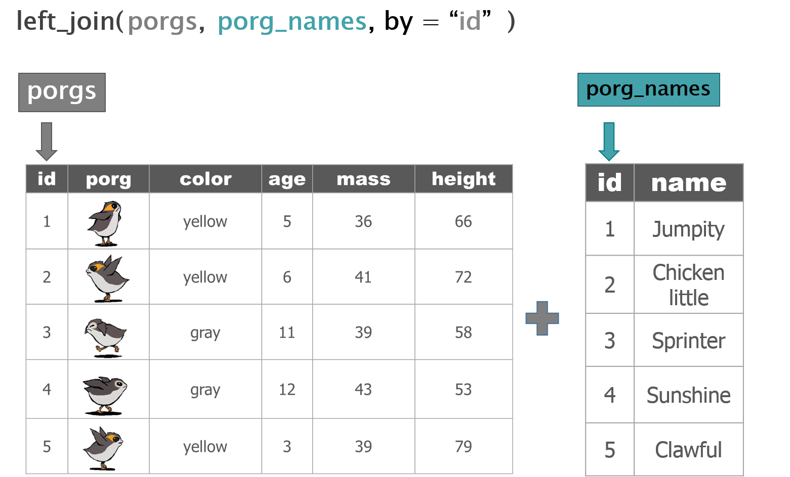
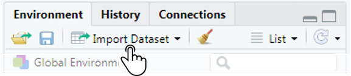
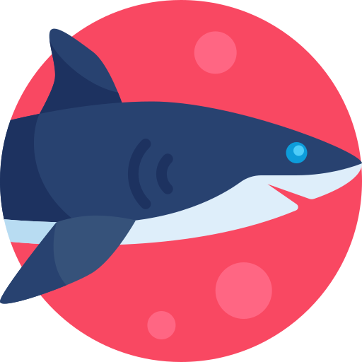

```{r setup, include=F}
knitr::opts_chunk$set(echo=TRUE, eval=FALSE, error=F, message=F, warning=F)
library("rmarkdown")
htmltools::tagList(rmarkdown::html_dependency_font_awesome())
```

<div class="banner" style="margin-bottom: 0px;"><div class="left">
<h1 style="margin-left: 20px; color: #cfcfcf; margin-top: 10px; font-size: 58px;"> R
<span style="font-size: 25px;"><i class="fas fa-cloud"></i><i class="fas fa-tint"></i><i class="fas fa-seedling"></i><i class="fas fa-tree"></i></span></h1>

<h2 style="margin-left: 22px; color: #cfcfcf; margin-top: -34px;"> for MINNESOTA</h2>
</div>

<div class="right" style="margin-left: 7%; width: 37%;">
<h5 style="margin-left: 20px; color: #cfcfcf; margin-top: 56px;"> Online training @ <span style="font-size: 16px; color: white;"> mn-r.netlify.app </span></h5>

<h5 style="margin-left: 20px; color: #cfcfcf;"> Please remember porgs are not for dinner.</h5>
</div></div>

{style="float: left; width: 90px; margin-top: -110px; margin-left: 25px; -webkit-transform: scaleX(-1); transform: scaleX(-1);"}

<div class="clearbox" style="width: 22.2%; clear: both;">
<div class="header"> SELECT COLUMNS</div>
<div class="linebox">
```{r}
# Keep only 2 columns
select(porgs, id, age)
# Drop the mass column
select(porgs, -mass)
# Put the age column first, but
# keep everything else the same
select(porgs, age, everything())
```
</div>

<div class="header"> SORT ROWS </div>
<div class="linebox">
```{r}
# Sort by age w/ YOUNGEST on top
arrange(porgs, age)
# Sort by age w/ ELDEST on top
arrange(porgs, desc(age))
# Sort by colors and then by age
arrange(porgs, color, desc(age))
```
</div>

{style="float: left; width: 23%; margin-left: 35%; margin-top: 174px;"}
{style="float: left; width: 30%; margin-top: 76px;"}
{style="float: left; width: 42%; margin-top: -125px; margin-left: 63px;"}


</div>


<div class="clearbox" style="width: 26%;">
<div class="header"> <i class="fas fa-calendar"></i> DATES </div>
<div class="fullbox" style="width: 100%;">
<div class="in-header"> Convert text to Date </div>
<div style="margin-left: 6px;  margin-top: -12px;">

| Function    |  Order of Input             |   Output |
|----|:-------------------------------------------------|----------|
|`mdy()  `    | Month-Day-Year :: `05-18-2019`                         | `2019-05-18`                |
|`mdy_hm() `  | Month-Day-Year Hour:Minutes ::  `05-18-2019 8:35`      | `2019-05-18` `08:35:00 UTC` |
|`mdy_hms() ` | Month-Day-Year Hour:Mins:Secs ::  `05-18-2019 8:35:22` | `2019-05-18` `08:35:22 UTC` |

</div>

<div class="in-header"> Date parts </div>
<div style="margin-left: 6px; margin-top: -12px;">

| Function  |  Date element             |   
|----|:--------------------------|  
|`year()  `  | Year              |  
|`month() `  | Month as _1,2,3_  |  
|`day()  `   | Day of the month  |  
|`wday()`    | Day of the week   |     
|`hour() `   | Hour of the day _(24hr)_ |  
|`tz() `     | Time zone         | 
  
</div>
</div></div>

<div class="clearbox" style="width: 48.2%;">
<div class="header"> JOIN TABLES </div>
<div class="linebox" style="width: 100%;">
<p class="in-header" style="font-size: 14px; margin-bottom: 3px;">
`left_join()` keeps all rows and columns in the left table, and joins rows in the right table with matching IDs. </p>

<div style="width: 47.4%; float: left; margin-top:6px;">

```{r}
# Table w/ porg ages and heights
porgs

# Table w/ porg names
porg_names

# Join together by id columns
together <- left_join(porgs, 
                      porg_names, 
                      by = "id")


```
</div>

<div class="fullbox" style="width: 50.6%; margin-left: 10px;">

{style="margin-top: 2px; margin-bottom: -4px;"}

</div></div>


<div class="header"> SAVE DATA </div>
<div class="linebox" style="width: 49.9%; padding-bottom: 15px;">
<div class="in-header"> Data tables </div>
```{r}
library(readr)
# Save data to a CSV text file
write_csv(porgs, "my_porg_data.csv")
```

<div class="in-header"> Plots and images </div>
```{r}
library(ggsave) 
# Save the last plot you made
ggsave("most_recent_plot.png")
# Save earlier plot stored to variable
best_plot <- ggplot()
ggsave(best_plot, "best_plot.png")
```
</div>


<div style="float: left; margin-left: 18px; margin-top: -36px; width: 47.4%;">
<div class="header" style="margin-left: 8px;"> <i class="far fa-question-circle"></i> HELP! </div>
<div class="linebox" style="width: 100%;">
<div class="in-header"> Online </div>

- Google: `r` or `rstats` + `"question"`
- [Stackoverflow.com](https://stackoverflow.com/questions/12675147/how-can-we-make-xkcd-style-graphs) + `[r]` tag
- TEAMS Channel - [Help requests!](https://teams.microsoft.com/l/channel/19%3afac52c418e5f48b48ba3fd5a3fc47140%40thread.skype/Requests%2520for%2520assistance?groupId=44cb2676-6137-4f1c-b7d0-9fbd672f9c65&tenantId=eb14b046-24c4-4519-8f26-b89c2159828c)

<div class="in-header"> From R </div>

- Go to: `Help > Cheatsheets`
- Type `?` in the _Console_
```{r}
# Function help
?read_csv
# Search help
help.search("boxplot")
```
</div>
</div>


<div class="header" style="width: 50%; "> <i class="fas fa-users"></i> R COMMUNITY </div>
<div class="fullbox" style="width: 50%; padding-top: 12px; float: left;">

- `#rstats` on <i class="fa fa-twitter"></i>
- ROpenSci.org
- [Rweekly.org](https://rweekly.org/)
- RLadies.org
- R-Bloggers.com
- [TidyTuesdays](https://github.com/rfordatascience/tidytuesday)
- __useR__ Conferences

</div>

<div style="float: left; margin-left: 18px; margin-top: -36px; width: 47.4%;">
<div class="header" style="margin-left: 8px;"> SHORTCUTS </div>
<div class="linebox" style="width: 100%; padding-top: 12px;">

- Run line: `CTRL`+`ENTER`
- Save script: `CTRL`+`S`
- Tidy code: `highlight`+`CTRL`+`Shift`+`A`

<div class="in-header"> Find data </div>

</div>

</div></div>


<br>
<div style="clear: both;"></div>
<div class="clearbox" style="clear: both; width: 48.6%; margin-top: -288px;">
<div class="header"> IFELSE: YES / NO DECISIONS </div>
<div class="linebox" style="width: 81%;">
<p class="in-header" style="font-size: 16px; margin-bottom: 3px;"> Use `ifelse()` to create new values that depend on the value of another column. For example, to only label the porgs with a height over _60 cm_ as "tall".</p>
```{r}
# When a porg's height is > 60 cm label it as "tall", 
# otherwise label it as "short"
mutate(porgs, label = ifelse(height > 60, "tall", "short"))
```
</div>
</div>

<div class="clearbox" style="width: 100%; color: white; margin-left: 0; margin-top: -40px; clear: both;">
<div class="bluebox" style="margin-top: 16px; margin-left: -20px; padding-left: 30px; padding-right: 40px; width: 100%; padding-top: 12px;">
<div class="header" style="margin-bottom: 6px; margin-left: 0; color: white; margin-top: 9px;"> R Support Crew </div>
<div style="width: 99%;">

<div class="tiny" style="margin-left: 15%; margin-top:-35px;">
<div style="float: left;">
{width=34 style="float: left; margin-right: 10px;"} Barbara.Monaco 
</div>

<div style="float: left; margin-left: 3%;">
{width=34 style="float: left; margin-right: 10px;"} Kristie.Ellickson
</div>


<div style="float: left; margin-left: 3%;">
{width=34 style="float: left; margin-right: 10px;"} Dorian.Kvale
</div>

<div style="float: left; margin-left: 3%;">
{width=34 style="float: left; margin-right: 10px; margin-bottom: 10px;"} Carl.Stenoien
</div>


<div style="float: left; margin-left: 3%;">
{width=34 style="float: left; margin-right: 10px;"} Andrea.Borich
</div>

<div style="float: left; margin-left: 3%;">
{width=34 style="float: left; margin-right: 10px;"} Derek.Nagel
</div>

</div>
</div></div></div>

```{r, echo=F}
# ITEP/NTF staff
'
{width=34 style="float: left; margin-right: 12px;"} [Melinda.Ronca-Battista@nau.edu](Melinda.Ronca-Battista@nau.edu)

{width=34 style="float: left; margin-right: 12px;"} [VallenC@grandportage.com](Vallenc@grandportage.com)

{width=34 style="float: left; margin-right: 12px;"} [Jaime.Yazzie@nau.edu](Jaime.Yazzie@nau.edu)

```

