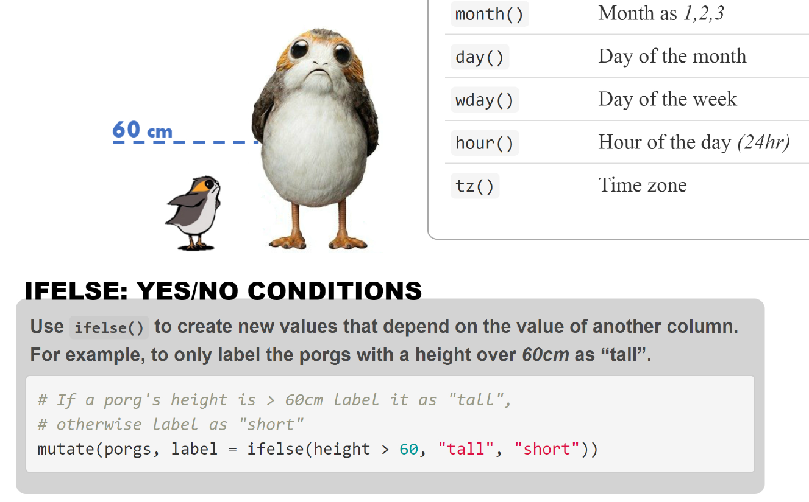

# R camp cheatsheet

 

- [Front page](https://tidy-mn.github.io/cheatsheet/R/Front_MN_R_Cheatsheet.html)
- [Back page](https://tidy-mn.github.io/cheatsheet/R/Back_MN_R_Cheatsheet.html)
- [PDF download](https://tidy-mn.github.io/cheatsheet/MN_R_Cheatsheet.pdf)

 

